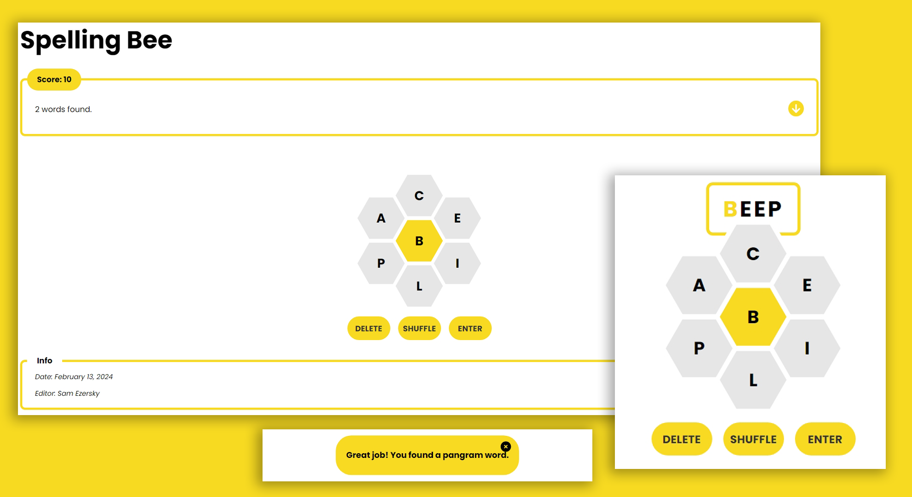

# Spelling Bee Game

> Game that is made as a final project of Understanding React Tutorial by Anthony Alicea.

This is a word game distributed in print and electronic format by The New York Times as part of The New York Times Games. Created by Frank Longo, the game debuted in a weekly print format in 2014. A digital daily version with an altered scoring system launched on May 9, 2018.

<!-- toc -->

- [Gameplay](#gameplay)
- [Creation](#creation)

<!-- tocstop -->

## Gameplay

The game presents players with a hexagonal grid of 7 letters arrayed in a honeycomb structure. The player scores points by using the letters to form words consisting of four or more letters. However, any words proposed by the player must include the letter at the center of the honeycomb. Each letter can be used more than once. Scoring points leads to progressively higher praise for the player's effort, such as "Solid", "Amazing", and "Genius". Each puzzle is guaranteed to have at least one pangram, which awards the player the largest number of points when found. If the player finds all of the possible words in a given puzzle, they achieve the title of "Queen Bee".

## Creation

Spelling Bee was created by Frank Longo following a proposal from Will Shortz, who was inspired by the puzzle game Polygon from The Times. The game launched in its print format in 2014 as a weekly feature in The New York Times Magazine. The game's digital version debuted on May 9, 2018. The cartoon bee mascot, Beeatrice, was designed by Robert Vinluan for the digital version. As of August 2021, the game is maintained by Sam Ezersky, who is responsible for constructing the daily puzzle, which goes live at 3 A.M. Eastern Time every day.

---
